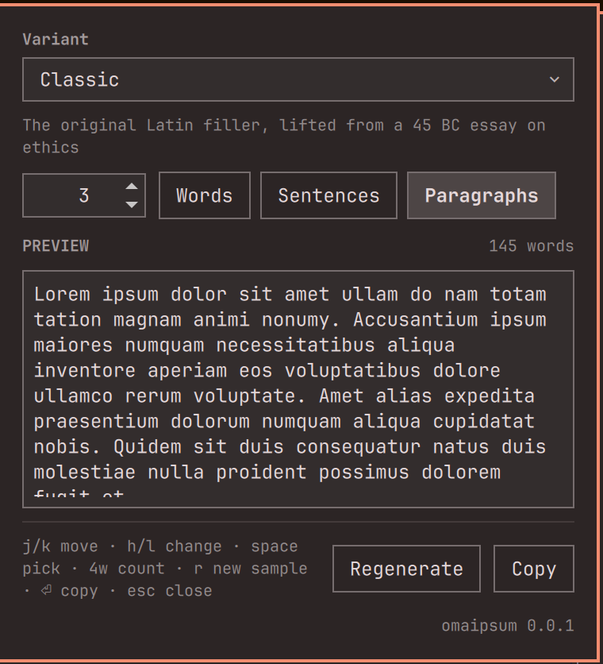
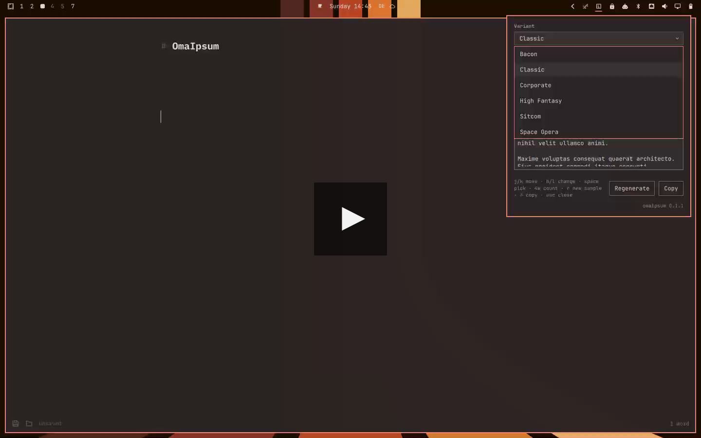

# omaipsum

Placeholder text from the bar, for [Omarchy 4](https://omarchy.org). Click the
document icon, pick how much of what you want, read exactly what you are about
to get, and copy it. It is for anyone who fills a layout with filler text often
enough to be tired of opening a website for it — designers, front-end
developers, anyone writing a template.



[](docs/screencast.mp4)

*A minute of it working, with narration — GitHub plays it in the file view.*

Six text variants ship with it: the Latin one everybody knows, and five that
are easier to read past. You choose words, sentences or paragraphs, and you get
exactly the number you asked for.

## Requirements

| | | |
|---|---|---|
| Omarchy 4 | required | It is a shell plugin: `omarchy-shell` loads it, and `omarchy` registers it. Nothing runs without one. |
| `wl-clipboard` | required for copying | Provides `wl-copy`, which is how the text reaches the clipboard. Everything else — the variants, the preview, Regenerate — works without it, and the panel says so above the Copy button rather than failing silently when you press it. |

That is the whole list. The notification you get after a copy goes out through
`omarchy-notification-send`, which is part of Omarchy itself rather than a
package you install, so it is covered by the row above and is not a dependency
of its own.

## Install

Through Omarchy's own installer, which asks which bar section to put the widget
in:

```bash
omarchy plugin add https://github.com/cschaba/omaipsum.git --enable
```

Do not add `--yes` if you want that prompt — it answers every question for you.

Or from a clone, which is the better choice if you intend to edit the corpora:

```bash
git clone https://github.com/cschaba/omaipsum.git
cd omaipsum
./install.sh
```

`install.sh` symlinks the checkout into
`~/.config/omarchy/plugins/cschaba.omaipsum` — a link, not a copy, so an edit
in the checkout is live after a shell restart — then registers it with
`omarchy plugin enable` and `omarchy bar put`. It is safe to re-run: `bar put`
leaves a widget that is already on the bar where you put it. If that plugin
path is a real directory rather than the link it made, it stops rather than
deleting somebody's files.

It then checks for `wl-copy` and, if it is missing, suggests
`omarchy pkg add wl-clipboard` rather than installing anything itself.

Either way, **restart the shell** to load it:

```bash
omarchy restart shell
```

`omarchy-shell` reads a plugin's QML once at startup and keeps it for the life
of the process, so a restart is also how you see any later edit.

### The keybinding, which you add yourself

The pulldown opens from its bar icon. If you want a key for it as well,
`install.sh` **prints** the line rather than writing it:

```lua
-- in ~/.config/hypr/bindings.lua
-- omaipsum
o.bind("SUPER + ALT + I", "Lorem ipsum", "omarchy-shell cschaba.omaipsum.widget toggle")
```

followed by `hyprctl reload`. omaipsum never edits your Hyprland config
itself — it prints the line and you paste it. If `SUPER + ALT + I` already
appears in that file it says so, and points you at
`omarchy menu keybindings --print` to find a free chord.

The one file outside omaipsum's own directories that changes is
`~/.config/omarchy/shell.json`, and omaipsum does not write it: `install.sh`
calls `omarchy plugin enable` and `omarchy bar put`, and Omarchy writes its own
config to record that you added a widget. `uninstall.sh` reverses it the same
way.

## Usage

Click the document icon in the bar — or press your keybinding, if you added
one. The panel opens on a fresh sample every time, in whatever defaults you
configured; it does not carry the last session's settings into the next one.

Top to bottom, it is: the **variant** picker with a one-line description of the
variant underneath, an **amount** and a **unit** (words, sentences,
paragraphs), a **preview** with the word count beside its heading, and
**Regenerate** and **Copy**.

The preview is exactly the text that will be copied — the same string, built
once — so there is nothing to check afterwards. It has a fixed height and
scrolls, so changing the amount never shoves the buttons around while you are
still holding the key.

**Regenerate** rolls a different sample of the same variant, unit and amount.
**Copy** puts it on the clipboard, closes the panel, and sends a notification
saying what landed — "3 paragraphs of Bacon copied", with the word count
underneath.

### Keys

The cursor is hidden until you press a movement key, and that first press only
reveals it: landing on a control and changing it in the same keystroke is not
something you want from a panel you just opened.

| Key | Action |
|-----|--------|
| `j` `k` `↓` `↑` | move down and up: variant, unit, amount, buttons |
| `h` `l` `←` `→` | on **unit**, switch between words, sentences and paragraphs; on **amount**, change the number (by 5 for words, by 1 otherwise); on the button row, move between Regenerate and Copy |
| `Space` | work the control under the cursor: open the variant list, hand the keyboard to the amount field, or press the highlighted button |
| `r` | a new sample, from anywhere |
| `Enter` | copy, from anywhere |
| `PgUp` `PgDn` | scroll the preview |
| `Esc` | close the panel |

In the open variant list, `j` `k` `↓` `↑` move, `Enter` picks and `Esc` closes
the list without changing anything.

With the amount field focused — after `Space` on it — the digits go into the
field, so a three-digit count is three keystrokes. `Esc` hands the keyboard
back to the panel rather than closing it.

The amount is clamped to what the unit can sensibly carry: **500** words,
**100** sentences, **40** paragraphs. All three land near the same amount of
text, and past what anyone pastes as placeholder.

## The variants

| Variant | | Where the words come from |
|---|---|---|
| **Classic** | The original Latin filler, lifted from a 45 BC essay on ethics | Latin vocabulary from Cicero, *De finibus bonorum et malorum* (45 BC), the text the standard lorem ipsum passage was garbled out of. Cicero died in 43 BC and the work is in the public domain worldwide by age; no licence applies. |
| **Bacon** | Cuts, cures and cooking heat, for people who read menus instead of filler | Word pool written from scratch for omaipsum in the style of the "meat ipsum" genre. Nothing was copied from baconipsum.com or any other generator: these are ordinary English butchery and cooking terms. Original to this project and covered by this repository's licence. |
| **Corporate** | Consultancy buzzwords that align, leverage and circle back to nothing | Word pool written from scratch for omaipsum in the style of the corporate-jargon ipsum genre. No list was copied from any generator; these are ordinary business-speak terms. Original to this project and covered by this repository's licence. |
| **Space Opera** | Hyperdrives, smugglers and blaster fire, with the serial numbers filed off in a galaxy legal counsel could not name | Word pool written from scratch for omaipsum in the style of the space-opera genre. Ordinary English science-fiction vocabulary only: no character names, place names or invented terms from any film, book or series, and no list was copied from any generator, wiki or fan site. Original to this project and covered by this repository's licence. |
| **High Fantasy** | Oaths, barrows and doomed fellowships, for copy that walks the whole way when it could have taken a horse | Word pool written from scratch for omaipsum in the style of the high-fantasy genre. Ordinary English words drawn from medieval and folkloric vocabulary that long predates any modern novel: no character names, place names or authors' invented terms, and no list was copied from any generator, wiki or fan site. Original to this project and covered by this repository's licence. |
| **Sitcom** | Recliners, casseroles and a laugh track, for filler that resolves everything in twenty-two minutes | Word pool written from scratch for omaipsum in the style of the suburban-sitcom genre. Ordinary English domestic and television vocabulary only: no character names, catchphrases or material from any series, and no list was copied from any generator, wiki or fan site. Original to this project and covered by this repository's licence. |

### Adding your own

A variant is one JSON file in [`corpora/`](corpora/) and nothing else — the
widget reads that directory rather than a list, so a fourth file is a fourth
entry in the picker after a shell restart. The file holds an `id` matching its
filename, a `name` and a one-line `blurb` for the picker, an `attribution` and
a `source`, an optional `opening` phrase, and a flat array of at least 120
plain lowercase words. The generator does all the typography: it capitalises,
places the commas and full stops, and groups words into sentences and
paragraphs, so the word pool stays a word list.

[`corpora/README.md`](corpora/README.md) has the full schema and the licensing
rule the shipped variants follow: write your own pool rather than copying a
curated list off someone's site, and only bundle text whose status you can
name.

## Settings

Three, all of them about what the pulldown opens in. Change them in Setup →
Plugins, or from the command line:

```bash
omarchy bar set cschaba.omaipsum variant bacon
omarchy bar set cschaba.omaipsum unit words
omarchy bar set cschaba.omaipsum count 50
```

| Setting | Default | What it does |
|---|---|---|
| `variant` | `classic` | The id of a file in `corpora/` — `classic`, `bacon` or `corporate`. An id no file matches falls back to the first variant rather than leaving the picker empty. |
| `unit` | `paragraphs` | What the count counts when the pulldown opens: `words`, `sentences` or `paragraphs`. |
| `count` | `3` | How many of that unit to generate on open. |

`count` is a starting point rather than a limit: the pulldown clamps it per
unit — 500 words, 100 sentences, 40 paragraphs — so a count set higher than the
current unit allows opens at the unit's maximum.

## Uninstall

```bash
./uninstall.sh            # take it off the bar, disable it, remove the link
./uninstall.sh --purge    # also remove omaipsum's own config and state
```

It unregisters through `omarchy plugin disable` and removes the symlink
`install.sh` made. Your checkout is never deleted, and `./install.sh` puts it
back. `--purge` additionally removes `~/.config/omaipsum` and
`~/.local/state/omaipsum`, neither of which this version creates.

The keybinding is yours to delete, for the same reason it was yours to add:
`install.sh` never wrote it, so `uninstall.sh` will not remove it. If one is
there, the script prints the line and its line number for you to take out,
followed by `hyprctl reload`.

## Working on it

omaipsum is a directory of QML, a JavaScript generator and two shell scripts.
[DEVELOPMENT.md](DEVELOPMENT.md) is where to start.

## Documentation

| | |
|---|---|
| [DEVELOPMENT.md](DEVELOPMENT.md) | the entry point for working on omaipsum |
| [docs/DEVELOPER.md](docs/DEVELOPER.md) | the layout, the edit loop, tests |
| [docs/DEVOPS.md](docs/DEVOPS.md) | remotes, CI, releasing, install mechanics |
| [docs/ARCHITECTURE.md](docs/ARCHITECTURE.md) | why it is shaped like this |
| [AGENTS.md](AGENTS.md) | the conventions a change is expected to follow |
| [CHANGELOG.md](CHANGELOG.md) | what changed when |
| [corpora/README.md](corpora/README.md) | the corpus schema for a variant |

## How this was built

omaipsum was written with heavy use of AI: essentially all of the code,
the tests and the documentation were produced by Claude, working from issues
and review by a human maintainer who directed the work and made the decisions.

This is worth saying plainly rather than leaving you to infer it. What it means
in practice, if you are deciding whether to trust it:

- Every change went through the same gate as any other — one issue, one branch,
  a test suite that runs in CI, and a review before merge.
- The parts that touch your machine got tested on a real one rather than
  reasoned about: the plugin was installed, the shell restarted, the pulldown
  driven with synthetic key and mouse events, and the clipboard read back.
  Several bugs in this repository were found that way and no other.
- The reasoning behind the significant decisions is written down in
  [docs/ARCHITECTURE.md](docs/ARCHITECTURE.md) — not because a tool produced
  them, but because a decision you cannot see the reason for is one you cannot
  safely change.

It reads no files outside its own directories, runs no package manager, and
needs no privileges; [AGENTS.md](AGENTS.md) states those rules and
`install.sh` and `uninstall.sh` are short enough to read in a minute. That is
the better basis for trusting it than who or what typed it.

## License

MIT — Copyright (c) 2026 omaipsum contributors. The full text is in
[LICENSE](LICENSE). The bundled word pools are covered by it too, except
`classic`, which is public domain by age; see the table above.
